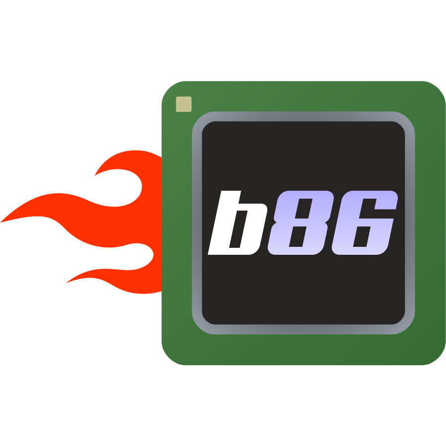

Linux用户空间的x86应用模拟器 

[更新历史](https://github.com/ptitSeb/box86/blob/master/docs/CHANGELOG.md) | [English](https://github.com/ptitSeb/box86/blob/master/docs/README.md) | [Українська](https://github.com/ptitSeb/box86/blob/master/docs/README_UK.md) | [报告错误](https://github.com/ptitSeb/box86/issues/new)

     

----

使用Box86可以在ARM或其他非x86架构的Linux操作系统上运行x86 Linux程序（例如游戏），请注意，主机系统需要是**32位小端**的。

你需要一个**32位**的子系统来运行Box86，因为Box86在纯64位系统上无法使用，同时你也需要一个**32位**的Linux编译工具链来编译Box86，例如**arm-linux-gnueabihf-gcc**， 否则你将无法编译Box86 （一般的64位ARM编译工具链如 aarch64-linux-gnu-gcc 不支持"-marm"编译选项，会编译失败并报错）。

因为Box86使用了一些“系统”库的原生版本，例如libc、libm、SDL和OpenGL，所以在很多情况下性能很不错，也可以方便地与其他应用集成使用。点击[此处](https://box86.org/index.php/2021/06/game-performances/)查看Benchmark示例。

大多数x86游戏都用到了OpenGL，所以在ARM平台上类似于[gl4es](https://github.com/ptitSeb/gl4es)的解决方案通常是必要的。（许多ARM平台仅提供OpenGL ES支持，又或者他们的OpenGL实现很不可靠（例如Android上的OpenGL）。）

Box86为ARM平台集成了DynaRec（动态重编译器），比仅使用解释器提升5到10倍性能。关于Dynarec如何工作的更多信息，可以在[这里](https://box86.org/2021/07/inner-workings-a-high%e2%80%91level-view-of-box86-and-a-low%e2%80%91level-view-of-the-dynarec/)找到。

许多游戏已可在不做多少改动的情况下直接运行，例如：《粘粘世界》(WorldOfGoo)、《航空大亨豪华版》(Airline Tycoon Deluxe)、《超越光速》(FTL)等、基于GameMaker的游戏（《传说之下》(UNDERTALE)等）。

如果你想开发Box86，最好安装ccache，以缓存编译结果。
如果你需要启用Trace跟踪（例如输出寄存器值与各条被执行的x86指令），你也需要安装[Zydis](https://github.com/zyantific/zydis)。

一些x86内部操作码使用“Realmode X86 Emulator Library”的部分内容，请参阅[x86primop.c](../src/emu/x86primop.c)了解版权详情 

----

编译与安装
----
> [Box86编译指南](COMPILE.md)
> 
> [Box86 Wine安装指南](X86WINE.md)

一些示例视频
----

     

在这几个Youtube频道可以找到更多Box86的相关视频

[MicroLinux](https://www.youtube.com/channel/UCwFQAEj1lp3out4n7BeBatQ)

[Pi Labs](https://www.youtube.com/channel/UCgfQjdc5RceRlTGfuthBs7g)

[The Byteman](https://www.youtube.com/channel/UCEr8lpIJ3B5Ctc5BvcOHSnA)

程序兼容性列表: https://github.com/ptitSeb/box86-compatibility-list/issues

感谢制作Logo和图标的grayduck!

注意：
不要把本项目和[86box](https://github.com/86Box/86Box)搞混了，后者是一个"**全量**"的x86 PC模拟器。

----

使用方法
----

有若干环境变量可以设置Box86的行为。

点击[这里](USAGE.md)了解所有的环境变量和它们的作用。

请注意：Box86的Dynarec提供了一种包含"内存保护"和段错误信号处理程序的机制来处理JIT代码。简单来说，如果你想用GDB来调试一个使用JIT代码的运行程序（比如mono/Unity3D），就会触发很多“正常”的段错误。建议在GDB中使用类似于`handle SIGSEGV nostop`的命令，来防止在每个段错误时都停止程序运行，如果你想捕获段错误，可以在`signals.c`中的`my_memprotectionhandler`中放置一个断点。

----

关于64位平台的注意事项
----

Box86的工作原理是直接将函数调用从x86_转换到主机系统，主机系统（Box86运行的系统）需要有32位的库。Box86并不包括任何64位<->32位的转换。所以如果你需要在64位平台上运行Box86，那么你需要建立一个32位的库环境，并以32位ARM为目标系统编译Box86（例如使用arm-linux-gnueabihf-gcc工具链交叉编译或直接在armhf chroot环境中编译运行）。

如果你需要运行64位应用，请考虑使用[Box64](https://github.com/ptitSeb/box64)，它可以在64位平台上运行x86_64程序，但请再一次注意运行x86程序需要Box86与32位库环境（就像在x86_64的Linux上运行x86程序需要x86 multiarch库一样）。

----

关于Unity游戏的注意事项
----

当前对于Unity游戏的模拟仍不完善。Unity使用Mono，但它所使用的信号机制还没有被完美模拟。理论上可以使用原生Mono库（在[这里](https://github.com/Unity-Technologies/mono)可以找到），但Mono的封装比较麻烦，现在还没完成，所以我们使用了模拟的Mono库，目前Mono的JIT动态编译代码已由"内存保护"(Protected memory)机制实现，应该能正常运行。

同时，一些Unity3D游戏需要OpenGL 3+，目前在大部分Arm开发板上提供OpenGL 3+是很困难的。

所以，并不是所有的Unity游戏都能运行，尤其是那些需要提供很高的OpenGL配置（3.2+）的游戏更有可能不行，但除此之外应该问题不大，而且能运行的游戏的性能应该不错。

提示：如果游戏开始后在显示任何东西之前退出，在Raspberry Pi4上使用`MESA_GL_VERSION_OVERRIDE=3.2`，在Panfrost上使用`PAN_MESA_DEBUG=gl3`来使用更高的配置文件。

----

关于Steam的注意事项
----

Linux Steam 现在可以在Box86上运行，但还是有点不稳定，而且有些功能可能不正常：
- 如果Steam在显示登录界面后崩溃，你可能需要安装libappindicator库，例如运行`sudo apt install libappindicator1`。
- 如果你选择记住密码，而Steam在下次启动时崩溃，你可能需要安装libnm库，例如运行`sudo apt install libnm0`。
- Steam不能在正常的大界面模式下工作，因为Steam在浏览器模式使用的一些组件只能在64位平台上运行。所以请在查看选项卡中选择"小模式"，否则Steam将无法正常显示列表。或者在启动Steam添加`+open steam://open/minigameslist`参数，这样Steam将会直接在小模式下启动。
- 为了避免"libc.so.6 is absent"的错误，请添加环境变量`STEAMOS=1` 与 `STEAM_RUNTIME=1`。
- 一些游戏（例如基于起源引擎的游戏：《传送门》、《半衰期2》）使用了libtcmalloc库，Box86会尝试检测它们并通过LD_PRELOAD预加载它们来获得更好的兼容性，虽然应该可以在没有上述功能的情况下工作，但保险起见，我们还是建议你安装它，例如运行`sudo apt install libtcmalloc-minimal4`。

Windows Steam 可以安装但目前不能运行。

----

关于Wine的注意事项
----

Box86现在已经支持Wine。Wine的内建程序全部能运行，许多Windows 程序和游戏也运行良好。但是不要忘记大多数 Windows 游戏都使用 Direct3D，这可能需要完整的 OpenGL 驱动程序和尽可能高的配置文件（基于 ES2 后端的 gl4es 现在不能运行 Wine 的Direct3D组件）。
注意：如果你想在 Raspberry Pi 3 或更早版本上用 Box86 运行 Wine，由于这些设备的内核默认使用 2G/2G 虚拟内存分配（2G 空间用于用户态程序，2G 空间用于内核），与需要访问内存地址 > 2G 的 Wine 程序不兼容。 因此，你需要重新配置内核以使用 3G/1G 的内存分配方式。

----

关于Vulkan的注意事项
----

Box86已经封装了Vulkan。如果设备的系统有32位的Vulkan驱动程序，Box86会在需要时使用它。但请注意，由于作者目前拥有的硬件上的Vulkan支持有限，因此Vulkan封装库尚未经过太多测试。 Vulkan 1.0、1.1与一些扩展应该能工作。 但Vulkan 1.2还没有被实现。已经有一些在树莓派4上的Vulkan演示 （Sascha Willems 的演示中，为x86构建的demo与与直接为armhf构建的demo工作均正常）。但请注意，Pi4的Vulkan驱动程序目前不支持 dxvk（wine DirectX->Vulkan 兼容层），这不是Box86的问题，而是由于缺少扩展（硬件支持）与一些其他驱动问题。而在Panfrost上，PanVK尚不成熟，暂时没有用它测试dxvk。

----

结语
----

我要感谢所有为 box86 开发做出贡献的人。
贡献方式有很多种：代码贡献、财务帮助、捐赠捐赠和广告合作！
以下感谢不分先后： 
 * 代码贡献：rajdakin, icecream95, M-HT
 * 财务帮助：FlyingFathead, stormchaser3000, dennis1248, sll00, [libre-computer-project](https://libre.computer/)
 * 硬件捐赠：[Radxa](https://rockpi.org/), [Pine64](https://www.pine64.org/), [DragonBox](https://pyra-handheld.com/), [Novaspirit](https://www.youtube.com/channel/UCrjKdwxaQMSV_NDywgKXVmw), [HardKernel](https://www.hardkernel.com/), [TwisterOS team](https://twisteros.com/)
 * 为本项目持续的宣传：([microLinux](https://www.youtube.com/channel/UCwFQAEj1lp3out4n7BeBatQ)), [PILab](https://www.youtube.com/channel/UCgfQjdc5RceRlTGfuthBs7g)/[TwisterOS team](https://twisteros.com/), [The Byteman](https://www.youtube.com/channel/UCEr8lpIJ3B5Ctc5BvcOHSnA), [NicoD](https://www.youtube.com/channel/UCpv7NFr0-9AB5xoklh3Snhg)

我还要感谢很多人，即使他们只参与了一次本项目。

(如果你的项目中使用了Box86，请不要忘记提及！)
